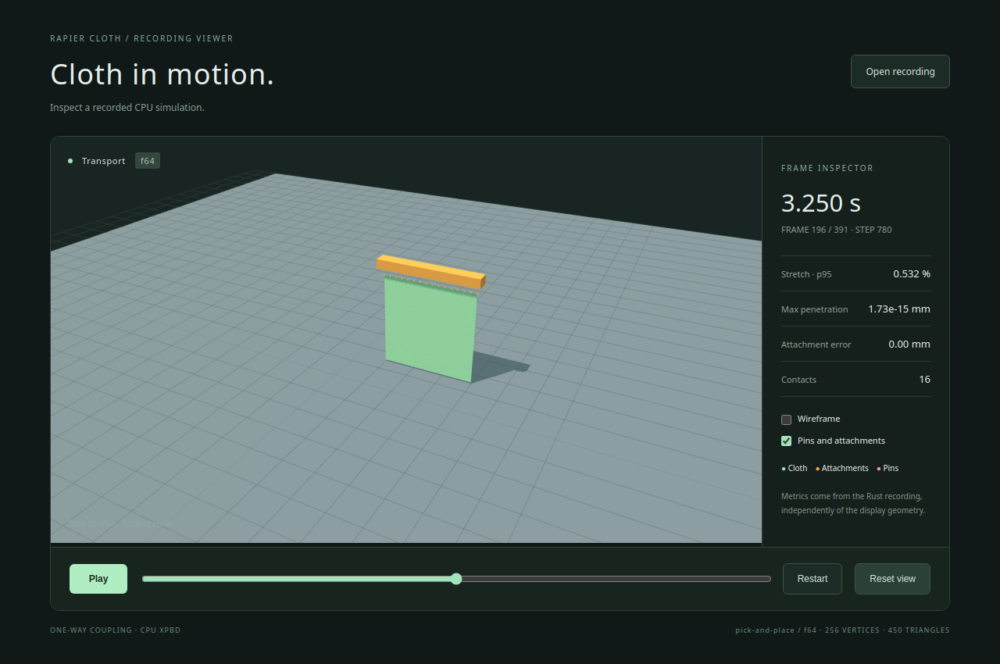

# Examples and demos

Run these commands from a repository checkout. Use release builds for interactive
work and performance measurements. For a graphical simulation, start with the
[live demo](live-demo.md); the Rust examples below are headless.

## Headless examples

| Example | Demonstrates | Output |
|---|---|---|
| [hanging_cloth](../examples/hanging_cloth.rs) | A 32×32 sheet pinned along one edge, using the core solver | Strain and pin error after 10 simulated seconds |
| [drape_static](../examples/drape_static.rs) | A 24×24 sheet falling onto a fixed sphere and floor | Strain, penetration and contact count after 5 seconds |
| [moving_anchor](../examples/moving_anchor.rs) | A particle attached to a kinematic body, then released | Released position and velocity after 1 second |
| [pick_and_place](../examples/pick_and_place.rs) | Multi-vertex grasping, lifting, transport and release | JSON summary and optional recording |

```bash
cargo run --locked --release --example hanging_cloth
cargo run --locked --release --example drape_static
cargo run --locked --release --example moving_anchor
cargo run --locked --release --example pick_and_place
```

The default precision is f32. Every example also supports f64:

```bash
cargo run --locked --release --no-default-features --features f64 --example hanging_cloth
```

These examples stop on simulation errors. Follow the
[recovery contract](integration.md#failures-and-recovery) before retrying a failed
step in your own application. The smaller headless examples use the library's
baseline material; the live demo uses a softer bending preset.

## Pick-and-place recording

```bash
cargo run --locked --release --example pick_and_place -- --help
cargo run --locked --release --example pick_and_place -- --record target/run-01/f32.json --summary target/run-01/f32-summary.json
cargo run --locked --release --no-default-features --features f64 --example pick_and_place -- --record target/run-01/f64.json --summary target/run-01/f64-summary.json
```

Use a new output path for each run: existing files are not overwritten. Parent
directories are created when needed. Without file options, the example prints the
summary to stdout. A recording is for inspection, not a solver checkpoint.

The [fixture](../examples/support/pick_fixture.json) defines a 16×16, 0.3 m square
cloth at 1/240 s with eight iterations. It attaches one edge's 16 vertices to a
single gripper at 0.5 s, lifts 0.3 m by 2 s, transports 0.4 m by 4 s and releases
while moving at 0.2 m/s. The simulation ends at 6.5 s. Recording every four substeps
produces 391 frames including the initial state.

Grasping uses explicit attachments. It does not model fingertip grasping through
static friction. Self-intersection can occur because self-collision is unsupported.
The summary records motion and deformation diagnostics separately; see the
[recording format](recording-format.md).

## Replay in the browser

```bash
npm --prefix demos/viewer ci
npm --prefix demos/viewer run dev
```

Open the URL printed by Vite, normally **http://127.0.0.1:5173/**. The viewer loads
an included f64 recording. Choose **Open recording** to load your own JSON. Use
**Play**, **Pause**, the timeline, **Restart** and **Reset view** to inspect motion.
Drag to orbit, scroll to zoom, and toggle wireframe or pin/attachment markers.

Playback reads recorded frames. For interactive physics and wind controls, open
`/live.html` with the [live server running](live-demo.md#start-the-demo).



The screenshot shows the included Rust f64 recording, rendered with Chromium
software WebGL. Display positions are converted to f32 for the GPU.

## Build and check the viewers

```bash
npm --prefix demos/viewer run build
npm --prefix demos/viewer exec -- playwright install chromium
npm --prefix demos/viewer run test
npm --prefix demos/viewer run test:live
```

The production build contains both replay and live pages. Live playback still
requires a Rust server; static HTML hosting alone cannot run native CPU physics.
Browser checks compare actual geometry buffers, normals, bounds, body poses and
markers with Rust output, then exercise playback or live controls. Screenshots are
written to `demos/viewer/test-results/`. See [Contributing](../CONTRIBUTING.md) for
both precision configurations and the full check commands.
