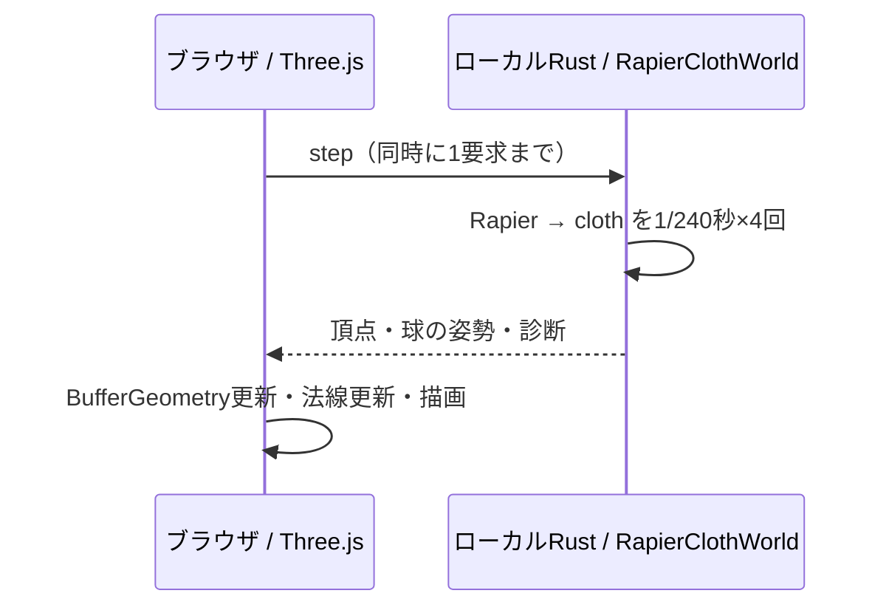
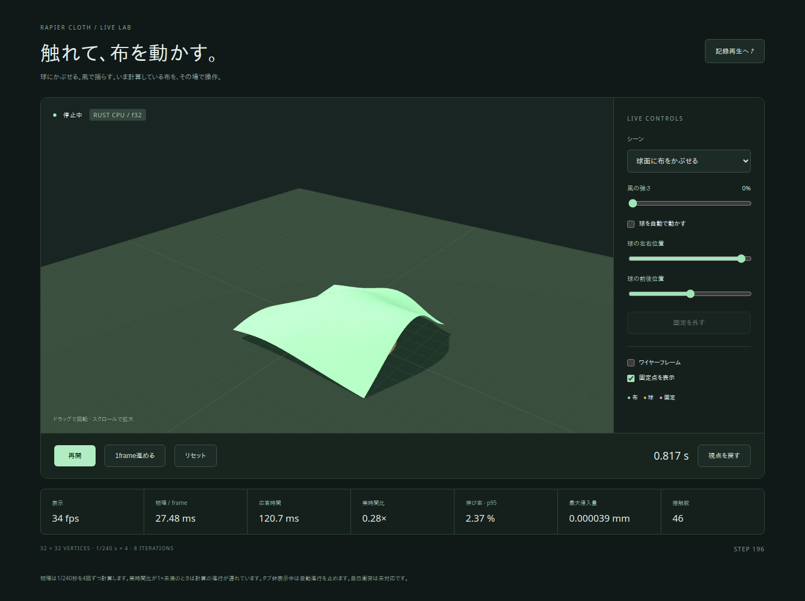

# ライブデモ

Rustの `RapierClothWorld` を毎frame実行し、その結果をブラウザで描画する。記録ファイルを使わず、操作が次の物理計算に反映される。32×32頂点・1枚、既定f32、h=1/240秒×4substep、8反復。

## 起動

リポジトリのcheckout、Rust 1.93.0（rust-toolchain.toml）、Node.js 22.12以上、WebGL対応ブラウザを用意する。

```bash
npm --prefix demos/viewer ci
npm --prefix demos/viewer run live
```

初回はRustのreleaseビルドを行う。起動後に **http://127.0.0.1:5173/live.html** を開く。Ctrl+CでCPUサーバーとViteの両方を終了する。サーバーは127.0.0.1:9100、画面は127.0.0.1:5173を使用する。使用中のポートを奪うことはしない。

別のポートを使う場合（bash）:

```bash
CLOTH_SERVER_PORT=9200 CLOTH_VIEWER_PORT=5273 npm --prefix demos/viewer run live
```

## 操作

| 操作 | 動作 |
|---|---|
| 球面に布をかぶせる | 自由な布を球面と床へ落とす。球の下半分を床に埋め、水平方向の自動移動で接触を変える |
| 風になびく布 | 一辺の32頂点を固定した布に風を加える |
| 風の強さ | 時間変化する外力を調整する。流体シミュレーションではなく、面密度に合わせた外力のデモ |
| 球の左右・前後位置 | 自動移動をOFFにして操作。目標へ最大0.25m/sで移動する |
| 停止 / 再開 | 新しい物理frameの要求を止める / 再開する。計算中の1frameは完了する |
| 1frame進める | 停止中に4substep進める |
| リセット / シーン変更 | 新しいworldを作り直し、時刻・布・球・風の設定を初期状態へ戻す |
| 固定を外す | 固定辺を解放する。その瞬間の位置と速度を保持する |
| ワイヤーフレーム / 固定点 | 描画だけを切り替える |
| 再接続 | 切断後、新しいworldで接続し直す |

カメラはドラッグで回転、スクロールで拡大できる。停止中もカメラ操作は可能。非表示のタブでは自動進行を止め、復帰時に失った時間の追いつき計算を行わない。自己衝突は未対応。

## 実行状況の読み方

- **表示fps**: ブラウザの描画ループの実測頻度。
- **物理 / frame**: Rustで4substepを計算した時間。Rapier、外力設定、clothの診断を含み、JSON変換・通信・描画を含まない。
- **応答時間**: 操作要求の送信から応答受信まで。物理、JSON、通信、ブラウザでのイベント処理待ちを含む。
- **実時間比**: 進んだシミュレーション時間 / 実際の経過時間。1×が実時間相当。停止中は0×になる。
- **伸び・侵入・接触**: 最新frame内の4substepにおける各診断の最大値。

遅い環境では時間刻みや反復数を落とさず、シミュレーションの進行が遅くなる。表示fpsだけでは物理が実時間で進んでいると判断できない。[CPU benchmark](benchmarks.ja.md#realtime-cpu)の結果は通信・描画込みの60fps保証ではない。Chromiumのsoftware WebGLによる自動試験は操作と描画データの検証で、実GPUの性能検証とは分ける。

## 構成と時間同期



`demos/live-server` は独立した非公開crateで、独立のCargo.lockを持つ。axum/Tokio/serde等はこのデモだけの依存で、公開するcore/bridgeの通常依存には追加しない。各WebSocket接続が独立したworldを持つ。Viteが `/live/ws` をローカルCPUサーバーへproxyする。

リクエストは `{request_id, command}`、commandは `step`、`reset`、`set_options`、`release`。接続時とreset時だけtopologyを送り、各応答では1,024頂点のflat配列、球の姿勢、固定点、実際のstep番号と時刻をJSONで送る。表示用頂点はf32に変換し、元の受信値は診断用に保持する。f64も同じ経路を使える。

クライアントは1要求の応答を待ってから次を送り、スライダーの未送信値は最新の値にまとめる。サーバーも要求処理と送信を逐次実行し、自律的なframe生成をしない。入力は2KiBまで、送信待ちは10秒まで。球の目標位置は±0.45m、実際の移動はsubstepごとに制限し、bridge本来のkinematic移動量チェックも維持する。設定エラーは状態を変更せず返す。物理エラー時は画面を停止し、リセットで両worldを作り直す。切断中に頂点を進めることはない。

実装に用いたAPI: [axum WebSocketUpgrade](https://docs.rs/axum/0.8.9/axum/extract/ws/struct.WebSocketUpgrade.html)、[Tokioのblocking task](https://docs.rs/tokio/latest/tokio/task/)、[Viteの複数HTML entry](https://vite.dev/guide/build.html#multi-page-app)。CPU処理は1要求につき4substepで終了する `spawn_blocking` に渡す。

## 個別起動・f64

```bash
# ターミナル1
cargo run --locked --release --manifest-path demos/live-server/Cargo.toml --no-default-features --features f64

# ターミナル2
npm --prefix demos/viewer run dev
```

http://127.0.0.1:5173/live.html を開く。独自のUIポートを使う場合はサーバーへ `--origin http://127.0.0.1:PORT` を渡す。Vite側のproxy先は `LIVE_SERVER_URL` で指定できる。静的HTMLだけをホスティングしてもライブ計算は動かない。

## 検証

```bash
cargo test --locked --manifest-path demos/live-server/Cargo.toml
cargo test --locked --manifest-path demos/live-server/Cargo.toml --no-default-features --features f64
cargo clippy --locked --manifest-path demos/live-server/Cargo.toml --all-targets -- -D warnings
npm --prefix demos/viewer exec -- playwright install chromium
npm --prefix demos/viewer run test:live
CLOTH_LIVE_PRECISION=f64 npm --prefix demos/viewer run test:live
```

既存Chromeを使う場合は `CHROME_PATH=/usr/bin/google-chrome` を指定する。テスト用のCPU/UIポートは9174/4174。UIはproduction buildをpreviewし、実際のRustサーバーを起動する。

Rust試験は4substep/frame、変形と接触、初期状態へのreset、目標速度制限、不正な値の拒否、固定解除を確認する。drapeは4,800substep（20秒分）を進め、全substepの侵入が1mm未満であることも検証する。ブラウザ試験は受信したWebSocket frameとGPU頂点・bounds・球の姿勢を照合し、操作後の変形、停止、1frame実行、リセット、風、固定解除、カメラ、接続間の独立性、切断・再接続を確認する。記録JSONの取得が発生していないことも検証する。



実際のRust f32サーバーを操作して撮影。球を移動した後、一時停止して確認した画面。表示されている時間・fpsはChromium software WebGLの操作試験時の値で、実GPUの性能値ではない。
