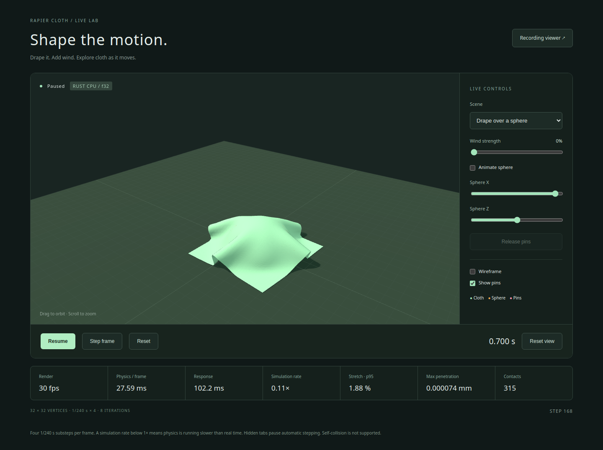

# Live cloth demo

The live demo runs `RapierClothWorld` on a local Rust CPU server and renders the
result in Three.js. Controls affect subsequent physics steps. It uses one 32×32
cloth, f32 by default, with four 1/240 s substeps and eight iterations per frame.

## Start the demo

You need a repository checkout, the Rust toolchain pinned in `rust-toolchain.toml`
(1.93.0), Node.js 22.12 or newer, and a WebGL-capable browser.

```bash
npm --prefix demos/viewer ci
npm --prefix demos/viewer run live
```

The first launch builds Rust in release mode. Open
**http://127.0.0.1:5173/live.html**. Press Ctrl+C in the terminal to stop both servers.
The CPU server binds to `127.0.0.1:9100`; Vite serves the UI on `127.0.0.1:5173`.
Startup fails if a required port is occupied.

To choose different ports in a shell that supports inline environment variables:

```bash
CLOTH_SERVER_PORT=9200 CLOTH_VIEWER_PORT=5273 npm --prefix demos/viewer run live
```

## Controls

| Control | Behavior |
|---|---|
| Drape over a sphere | Drop an unpinned sheet over a sphere and floor. The lower half of the sphere is embedded in the floor; it moves horizontally |
| Cloth in the wind | Pin one edge's 32 vertices and apply wind |
| Wind strength | Adjust a smooth force that varies with time and position across the cloth. Zero clears wind forces |
| Animate sphere | Move the sphere automatically |
| Sphere X / Sphere Z | With automatic motion off, choose a target position; actual speed is limited to 0.25 m/s |
| Pause / Resume | Stop requesting new physics frames, or resume. One frame already in progress may finish |
| Step frame | While paused, advance four substeps |
| Reset / Scene | Recreate both worlds and restore time, geometry and controls to scene defaults |
| Release pins | Unpin the edge while retaining its current position and velocity |
| Wireframe / Show pins | Change rendering only |
| Reconnect | After disconnection, start a new world in a paused state |

Drag to orbit the camera and scroll to zoom. Camera controls work while paused.
Hidden tabs stop automatic stepping. Returning to a tab does not trigger a backlog
of catch-up physics. Self-collision is unsupported.

The demo uses bending compliance `1e3` and stretch compliance `0` to allow folds
without making the edges intentionally elastic. Density, damping and friction use
the library defaults. This is a preset for this grid, not a measured fabric model.
Wind is a mass-scaled external force with travelling gusts, not fluid simulation.
See [materials](integration.md#materials) for the parameter meanings.

## Read the metrics

| Metric | Includes |
|---|---|
| Render | Measured browser render-loop frequency |
| Physics / frame | Four Rust substeps, including Rapier, forces and cloth diagnostics; excludes JSON, transport and rendering |
| Response | Request send to response receive, including physics, serialization, transport and browser scheduling |
| Simulation rate | Simulated time divided by elapsed wall time; 1× means real-time progress |
| Stretch / Penetration / Contacts | Maximum of each diagnostic across the latest frame's four substeps |

A slow environment advances simulation more slowly instead of lowering accuracy
settings. Render fps alone does not show whether physics keeps up with wall time.
The [CPU benchmarks](performance.md) exclude rendering and transport, so they do not
guarantee application-wide 60 fps. Measure on your target CPU and browser.

## Architecture

```mermaid
sequenceDiagram
    participant UI as Browser / Three.js
    participant CPU as Local Rust / RapierClothWorld
    UI->>CPU: step (one request in flight)
    CPU->>CPU: Rapier then cloth, 1/240 s × 4
    CPU-->>UI: Positions, sphere pose and diagnostics
    UI->>UI: Update geometry, normals and bounds; render
```

`demos/live-server` is an independent, unpublished crate with its own Cargo.lock.
Its networking dependencies are separate from the libraries. Each WebSocket
connection owns a world; Vite proxies `/live/ws` to the CPU server.

Requests contain `{request_id, command}`. Commands are `step`, `reset`, `set_options`
and `release`. Topology is sent on connection and reset; each frame includes the
1,024 positions as a flat array, sphere pose, pins, step index, time and diagnostics.
The browser converts positions to f32 for rendering and retains received values for
inspection. This transport is specific to the demo; it is not the
[recording schema](recording-format.md).

The client waits for a response before the next request and coalesces pending slider
values. The server processes and sends responses sequentially. It does not generate
frames autonomously. Input messages are limited to 2 KiB; sending has a 10-second
timeout. Sphere targets are within ±0.45 m and actual motion is constrained each
substep. Invalid options leave state unchanged. Physics errors stop advancement;
**Reset** recreates both worlds. Disconnection freezes the last displayed frame.

## Run components separately or use f64

```bash
# Terminal 1
cargo run --locked --release --manifest-path demos/live-server/Cargo.toml --no-default-features --features f64

# Terminal 2
npm --prefix demos/viewer run dev
```

Open `/live.html` at the Vite URL. For a custom UI port, pass
`--origin http://127.0.0.1:PORT` to the Rust executable (after Cargo's `--` separator).
Set Vite's `LIVE_SERVER_URL` environment variable to change the proxy destination.
The server only accepts configured browser origins and binds to loopback.

## Troubleshooting

- **Disconnected:** start the CPU server with `npm --prefix demos/viewer run live`,
  then choose **Reconnect** or reload the page.
- **Port in use:** stop the process using that port or choose alternate ports above.
- **Slow simulation rate:** use a release build, close other active demo tabs and
  inspect physics and response times separately.
- **Physics error:** use **Reset**. Continuing only the cloth world after Rapier has
  advanced would violate time synchronization.



Captured from the actual Rust f32 server with Chromium software WebGL. Displayed
frame timings describe that capture environment, not a hardware GPU benchmark.
