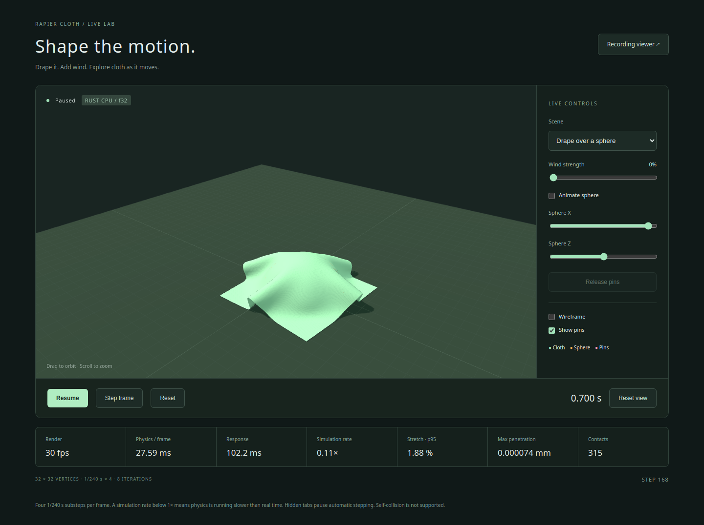

# Live cloth demo

The live demo runs `RapierClothWorld` on a local Rust CPU server and renders the
result in Three.js. Controls affect subsequent physics steps. It uses one 32×32
cloth, f32 by default, with four 1/240 s substeps and eight iterations per frame.
The optional implicit scene uses f64 and one 0.1 s step; see
[Rapier end-effector control](robot-control.md).

## Start the demo

You need a repository checkout, the Rust toolchain pinned in `rust-toolchain.toml`
(1.93.0), Node.js 22.12 or newer, and a WebGL-capable browser.

```bash
npm --prefix demos/viewer ci
npm --prefix demos/viewer run live
```

The first launch builds Rust in release mode. Open
**http://127.0.0.1:5173/live.html**. Press Ctrl+C in the terminal to stop both servers.
The CPU server binds to `127.0.0.1:9100`; Vite serves the UI on `127.0.0.1:5173`.
Startup fails if a required port is occupied.

To choose different ports in a shell that supports inline environment variables:

```bash
CLOTH_SERVER_PORT=9200 CLOTH_VIEWER_PORT=5273 npm --prefix demos/viewer run live
```

To build the implicit solver and start with pose control:

```bash
npm --prefix demos/viewer run live:implicit
```

Open **http://127.0.0.1:5173/live.html?scene=implicit_towel&paused=1**.
Press **Resume** for the complete reference fold or use the hand controls and
**Step frame** for manual motion. See [robot control](robot-control.md) for the
command contract, failure handling and headless reproduction.

## Controls

| Control | Behavior |
|---|---|
| Drape over a sphere | Drop an unpinned sheet over a sphere and floor. The lower half of the sphere is embedded in the floor; it moves horizontally |
| Cloth in the wind | Pin one edge's 32 vertices and apply wind |
| Towel fold · Implicit / pose control | Optional f64 implicit task; 5 mm position commands, 5 degree roll, release and regrasp |
| Towel half-fold · XPBD | Run the shared nominal dual-gripper task with continuous self/rigid contact |
| Wind strength | Adjust a smooth force that varies with time and position across the cloth. Zero clears wind forces |
| Animate sphere | Move the sphere automatically |
| Sphere X / Sphere Z | With automatic motion off, choose a target position; actual speed is limited to 0.25 m/s |
| Pause / Resume | Stop requesting new physics frames, or resume. One frame already in progress may finish |
| Step frame | While paused, request four XPBD substeps or one 0.1 s implicit step; a failure returns the accepted state |
| Reset / Scene | Recreate both worlds and restore time, geometry and controls to scene defaults |
| Release pins | Unpin the edge while retaining its current position and velocity |
| Release left / right gripper | Release that gripper's grasps without advancing time; the other gripper keeps holding |
| X/Y/Z ± / Roll ± | Queue the selected implicit hand's next world pose; enter manual mode |
| Grasp selected patch | Attach that implicit hand's original material patch at its current shape |
| Measure fold | Pause and measure the current corner alignment, projected overlap and footprint error without stepping |
| Wireframe / Show markers | Change rendering only |
| Reconnect | After disconnection, start a new world in a paused state |

Drag to orbit the camera and scroll to zoom. Camera controls work while paused.
Hidden tabs stop automatic stepping. Returning to a tab does not trigger a backlog
of catch-up physics. The drape/wind scenes leave self-collision disabled. Both towel
scenes enable continuous self and rigid collision checks. Wind and sphere controls apply only
to drape/wind scenes.

The drape/wind scenes use bending compliance `1e3` and stretch compliance `0` to allow folds
without making the edges intentionally elastic. Density, damping and friction use
the library defaults. This is a preset for this grid, not a measured fabric model.
Wind is a mass-scaled external force with travelling gusts, not fluid simulation.
See [materials](integration.md#materials) for the parameter meanings.

## Experimental towel task

Select **Towel half-fold · XPBD** to run the same fixture 2, nominal
trajectory and transactional substep as the [headless example](examples.md#experimental-towel-folding).
It uses a 0.5 m towel, 1 mm thickness and two kinematic grippers. Attachments are
ideal constraints; the boxes do not model a frictional fingertip pinch. Orange and
blue identify the left and right grippers. Anchor markers show commanded grasp
points; the protocol supports both vertex and weighted surface grasps, while the
scripted task uses four vertices per gripper.

Complete folding and real-time performance remain unqualified. The solver can stop
during lowering. If a four-substep request fails partway through, the shared task
rolls back the failing substep and returns the last accepted positions, body poses,
grasps and time. The UI displays the error and stops requesting physics. Use
**Reset** to clear the stopped task and recreate both worlds and all task/history
state. Resetting a scene does not advance simulation time.

Manual release changes the scripted task and is labeled in the UI. Each gripper
can release independently; vertex and weighted grasps owned by that gripper are
released together. Positions and velocities are retained. Releasing while stopped
does not clear the failure latch; reset before resuming physics.

**Measure fold** runs geometric measurement on demand, after any frame already in
flight. Its result is labeled with the accepted step and cleared when physics
advances. These instantaneous shape measurements do not establish released-fold
quality or replace the headless example's independent all-step audits. The complete
task ends after 3,600 substeps; if reached successfully, live physics continues
with stationary retracted grippers and a `Finished` task phase.

## Read the metrics

| Metric | Includes |
|---|---|
| Render | Actual redraw frequency; an unchanged paused view draws zero frames |
| Physics / frame | Latest physics request, including Rapier, cloth diagnostics and folding-task checkpoints/rollback; excludes frame construction, inspection, JSON, transport and rendering |
| Response | Request send to response receive, including physics, serialization, transport and browser scheduling |
| Simulation rate | Simulated time divided by elapsed wall time; 1× means real-time progress |
| Stretch / Penetration / Contacts / Attachment error | Maximum over accepted substeps in the latest physics request; if none succeeds, retain the previous diagnostics |

In the implicit scene the last four metrics are maximum edge extension, RMS
speed, held vertices and maximum speed. Rendering is invalidated by new physics
states, camera changes, resize and view options. Camera input remains responsive
while physics runs, and static shadows are reused. A low idle redraw count is
expected; it does not measure interaction latency.

A slow environment advances simulation more slowly instead of lowering accuracy
settings. Render fps alone does not show whether physics keeps up with wall time.
The [CPU benchmarks](performance.md) exclude rendering and transport, so they do not
guarantee application-wide 60 fps. Measure on your target CPU and browser.
A failed partial request is not a complete four-step timing sample. Folding's
on-demand shape inspection is included in response latency, not physics timing.

## Architecture

```mermaid
sequenceDiagram
    participant UI as Browser / Three.js
    participant CPU as Local Rust / RapierClothWorld
    UI->>CPU: step (one request in flight)
    CPU->>CPU: Rapier then cloth (scene-specific physical step)
    CPU-->>UI: Accepted state, obstacle/gripper poses and diagnostics
    UI->>UI: Update geometry, normals and bounds; render
```

`demos/live-server` is an independent, unpublished crate with its own Cargo.lock.
Its networking dependencies are separate from the libraries. Each WebSocket
connection owns a world; Vite proxies `/live/ws` to the CPU server.

Live protocol **2** requires matching server and viewer versions; protocol 1 frames
are rejected. Requests contain `{request_id, command}`. Commands are `step`,
`reset`, `set_options`, `release`, `release_gripper`, `inspect`,
`set_gripper_pose` and `grasp_gripper`. Commands are scene-specific. Topology is sent
on connection and reset; each frame includes the 1,024 positions as a flat array,
step index, time and diagnostics. `substeps` is the configured request size (4 for XPBD, 1 for implicit);
`advanced_substeps` is the number actually accepted by that request (0–4 or 0–1).
Commands that do not step return zero. Sphere fields apply to drape/wind scenes;
they are zero and hidden for folding.
The implicit scene adds `implicit_available` and an `implicit` task object;
see its [pose protocol](robot-control.md#connect-a-host-controller).
The browser converts positions to f32 for rendering and retains received values for
inspection. This transport is specific to the demo; it is not the
[recording schema](recording-format.md).

Folding requests include `{type: "reset", scene: "fold_towel"}`,
`{type: "release_gripper", gripper: 0}` (left) or `1` (right), and
`{type: "inspect"}`. Folding frames include `folding.config`, variant, phase,
actual collision-mode flags, gripper world/local collider poses and half-extents,
holding state, grasp points, manual-release status, optional stopped error and
optional inspection. Each grasp point names either a vertex or a triangle plus
barycentric weights, with its current material position and world-space anchor.
The nominal scene uses variant 0; other frozen variants remain available headlessly.

The client waits for a response before the next request and coalesces pending slider
values. Releases are coalesced per gripper, so the two hands do not overwrite each
other's queued commands. The server processes and sends responses sequentially. It does not generate
frames autonomously. Input messages are limited to 2 KiB; sending has a 10-second
timeout. Sphere targets are within ±0.45 m and actual motion is constrained each
substep. Invalid options leave state unchanged. Physics errors stop advancement;
**Reset** recreates both worlds. Disconnection freezes the last displayed frame.

## Run components separately or use f64

```bash
# Terminal 1
cargo run --locked --release --manifest-path demos/live-server/Cargo.toml --no-default-features --features f64

# Terminal 2
npm --prefix demos/viewer run dev
```

Open `/live.html` at the Vite URL. For a custom UI port, pass
`--origin http://127.0.0.1:PORT` to the Rust executable (after Cargo's `--` separator).
Set Vite's `LIVE_SERVER_URL` environment variable to change the proxy destination.
The server only accepts configured browser origins and binds to loopback.

## Troubleshooting

- **Disconnected:** start the CPU server with `npm --prefix demos/viewer run live`,
  then choose **Reconnect** or reload the page.
- **Port in use:** stop the process using that port or choose alternate ports above.
- **Slow simulation rate:** use a release build, close other active demo tabs and
  inspect physics and response times separately.
- **Physics error:** use **Reset**. Folding has restored its last accepted complete
  substep; other scenes may require rebuilding desynchronized worlds. Continuing
  only cloth after Rapier has advanced would violate time synchronization.
- **Protocol mismatch:** restart the server and viewer from the same checkout.



Captured from the actual Rust f32 server with Chromium software WebGL. Displayed
frame timings describe that capture environment, not a hardware GPU benchmark.
