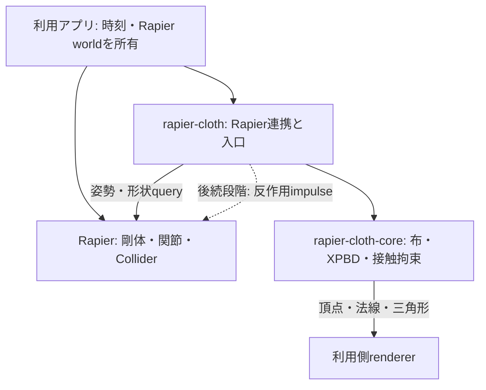

# rapier-cloth パッケージ構成の検討

> 本書は設計検討時の案。実装した公開APIと同期契約は[統合ガイド](integration.ja.md)、検証状態は[進捗](progress.md)を参照。

検討日: 2026-09-13。状態: 設計提案。以下のクレート、型、機能、コマンドは実装予定を表し、動作確認済みAPIではない。

具体的な変更単位、依存順序、テストと初版の完成条件は[実装プラン](implementation-plan.ja.md)に記載する。

**推奨する構成**

Rapierが剛体・関節・Colliderを所有し、独立したCPU版XPBDソルバが布を所有する。初期の公開パッケージは `rapier-cloth-core` と `rapier-cloth` の2つとする。描画エンジン、Bevy、botrailへの依存は計算部分に持ち込まない。

初期の到達点は「固定環境と移動するグリッパーに対して、布を掴み、持ち上げ、運び、離せること」。折り畳みの品質保証と動的剛体への双方向連成は、それぞれ独立した次の到達点にする。

これは[共有会話](https://chatgpt.com/share/6aa579ff-95c4-83e8-aec6-12be53af6684)の独立XPBD案を具体化したもの。会話に登場するbotrail・ロボット操作は利用候補として扱い、今回のユーザー指示で必須化された要件とは区別する。Web/npm、Python、GPU、Bevy統合の優先度は未指定なので、Rustライブラリを先行させる。

**確認した根拠と設計への影響**

| 確認事項 | 設計への影響 |
|---|---|
| このリポジトリは空のREADMEのみで、Cargo構成・実装がなかった | 既存APIとの互換性制約はない |
| 共有会話では独立XPBD、Rapier連携、描画、入口の4クレートが提案されていた | 責務の分離は採用し、初期の公開単位は2つにまとめる |
| 公開API資料のRapierは確認時点で0.35.3だった | 現行APIを参考にする一方、利用先の対応系列を別に決める |
| ローカルbotrailは `rapier3d-f64 = "0.34"`、lockfileは0.34.0だった | botrailへの接続を優先する初版は0.34系列を基準とする |
| botrailのParry依存は `parry3d-f64 = "0.29"`。Rapier adapterにも、この共有形状の互換性を維持する旨のコメントがある | cloth導入のためにbotrailのRapier/Parryを同時更新する計画にはしない |

公開版の確認先は [Rapier QueryPipeline](https://docs.rs/rapier3d/latest/rapier3d/pipeline/struct.QueryPipeline.html)。ローカルの確認箇所は `/home/nekanat/projects/botrail/crates/botrail-physics-rapier/Cargo.toml:13`、`/home/nekanat/projects/botrail/Cargo.lock:1355`、同adapterの `src/lib.rs:436`。ローカルcheckoutの観測であり、botrailの公開版や配備済み環境の状態を示すものではない。

0.34.0の `QueryPipeline`、`BroadPhaseBvh`、Parry再公開は、ローカルCargo registryの `rapier3d-f64-0.34.0/src/` でも確認した。依存先に合わせた小さなコンパイル実験は、実装開始時の最初の作業にする。

既存例として [bevy_silk](https://github.com/ManevilleF/bevy_silk#collisions) はRapier連携を提供するが、READMEは衝突対応を実験段階としている。[inertia](https://github.com/aclfe/inertia) は独自Verlet clothを持つアプリケーションである。両者は参考実装として位置付ける。本検討では、非Bevyの公開APIと検証可能な布操作を中心に設計する。

**公開パッケージとディレクトリ**

```text
rapier-cloth/
├── Cargo.toml                    # workspaceと入口package
├── Cargo.lock                    # 検証環境の依存を固定
├── src/                          # package: rapier-cloth
│   ├── lib.rs                    # coreの再公開、prelude、Rapier再公開
│   ├── world.rs                  # 利用者向けRapierClothWorld
│   ├── scene.rs                  # Rapier状態の借用と時刻情報
│   ├── collision.rs              # Collider候補・形状query・接触生成
│   ├── attachment.rs             # RigidBodyHandleと布の対応
│   ├── coupling.rs               # 接続モード、将来の反作用処理
│   └── diagnostics.rs            # Rapier固有のエラー・接触イベント
├── crates/
│   └── rapier-cloth-core/
│       ├── Cargo.toml
│       └── src/
│           ├── math.rs           # Real / Vec3、精度別alias
│           ├── mesh.rs           # rest mesh、検証、隣接関係
│           ├── material.rs       # 面密度・拘束パラメータ
│           ├── cloth.rs          # 粒子状態、ClothSet、handle
│           ├── constraints/      # stretch、shear、bend、target
│           ├── solver.rs         # XPBD、時間積分、反復
│           ├── contact.rs        # エンジン非依存の接触拘束・摩擦
│           ├── self_collision/   # 後続段階で実装
│           └── surface.rs        # 描画向けの頂点・法線・対応表
├── examples/                     # 描画不要のRust実行例
├── demos/viewer/                  # publish=false、描画依存はここ
├── tests/                        # Rapier連携・利用者APIの受入試験
├── benches/                      # 計算量・誤差・性能計測
└── docs/
    └── package-design.ja.md
```

| 公開単位 | 責務 | 主な依存 |
|---|---|---|
| `rapier-cloth-core` | メッシュ、質量、拘束、XPBD、布同士の接触、出力データ | 数学ライブラリ、エラー型。Rapierに依存しない |
| `rapier-cloth` | core再公開、Rapierの形状・姿勢の参照、attachment、接触・反作用の変換 | core、選択された精度のRapier |

初期には `rapier-cloth-render` を独立公開しない。法線生成はcoreの小さな幾何処理で足り、GPUバッファ更新は利用側の描画方式に依存する。将来、複数の描画統合に共有処理が生じたときに別クレート化する。Rapier adapterも、複数の物理エンジンや複数の非互換Rapier系列を同時に保守する必要が出た時点で `rapier-cloth-rapier3d` へ切り出せる。

共有会話の `drapier` はブランド名の候補として残す。現在のリポジトリ名に合わせ、この設計では `rapier-cloth` を使う。crate名の登録可能性は未確認で、公開前の確認項目とする。

**依存方向と所有権**



`RapierClothWorld` は布とcloth側の作業領域を所有する。Rapierの `RigidBodySet`、`ColliderSet`、`PhysicsPipeline` はアプリ側が所有し、布のstep中だけ参照を借りる。既存の剛体worldを複製せず、利用者の関節・フック・イベント処理と共存させる。

coreには `RigidBodyHandle`、`ColliderHandle`、Bevyの `Entity` を入れない。coreのtarget拘束には目標位置・速度を渡し、Rapier側のattachment表がそれを生成する。接触も、粒子または面のID、法線、接触点、分離距離、相手表面速度、adapterが管理する接触キーからなるデータとして渡す。

外部接触を生成する小さなコールバック境界は必要になる。予測後・拘束反復中に接触を再評価できるようにする。剛体生成や関節操作まで含む汎用 `PhysicsBackend` traitは初期APIに導入しない。

**数値精度・バージョン・配布**

0.1のRapier対応系列は0.34を提案する。botrailを接続先にしない場合は、実装開始時の互換性実験で0.35系列へ変更できる。対応を実証していない広いversion rangeは宣言しない。

| 選択 | 利用目的 | 提案するfeature |
|---|---|---|
| f32 | 通常のRapier 3Dアプリ | デフォルトの `f32` |
| f64 | 現在のbotrail、数値比較 | `default-features = false, features = ["f64"]` |
| CPU逐次処理 | 再現性の基準実装 | 初期の標準動作 |
| 並列計算、serde、WASM bindings | 用途が決まった時点の拡張 | 後続の任意featureまたは別クレート |

精度featureは排他的にする。両方有効・両方無効は明確なコンパイルエラーにする。入口からcoreへ選択を転送し、core依存には `default-features = false` を指定する。Cargoのfeature統合によって、別依存がcoreのデフォルトf32を有効にしないよう利用方法を示す。初版では同一依存グラフ内でのf32/f64同時利用を対象外とする。

coreの `Real` と `Vec3` は、選択精度のscalarと `glam::Vec3` / `glam::DVec3` のaliasを候補とする。ローカルRapier 0.34の数学型はParry/glamx系で、glamx 0.3はglam 0.33を使っていた。型の一致をコンパイルで検証し、必要な変換はadapterに閉じ込める。coreの数学型を `rapier::math` の再公開で定義すると独立性を失うため避ける。

低レベル形状queryは選択したRapierの `parry` 再公開から利用する。別versionのParryを入口へ直接追加して型の不一致を作らない。入口は採用Rapierを `rapier_cloth::rapier` として再公開し、利用者が同じ型を選べるようにする。

Rust crateを最初の配布物とする。coreと入口のバージョンは初期には揃え、Rapier対応表をREADMEへ掲載する。coreのWASMコンパイル可能性と、JavaScriptから既存Rapier worldへ接続できることは別に検証する。別WASMモジュール間でRustポインタやhandleを直接共有できる前提にはしない。npm/Python公開とそのworld連携方式は後続の設計対象とする。

**布モデルと公開データ**

| 型の案 | 内容・契約 |
|---|---|
| `ClothMesh` | rest位置、三角形、隣接関係。格子builderと三角形入力を提供 |
| `ClothMaterial` | 面密度、伸び・曲げのcompliance、減衰、摩擦、数値的な接触半径 |
| `ClothSet` / `ClothHandle` | 複数布を管理。削除後の古いhandleを識別 |
| `ClothState` | 位置、前位置、速度、逆質量を別配列で保持し、作業領域を再利用 |
| `SolverSettings` | 外部から渡すsubstep時間に対する反復数、許容誤差、接触予算 |
| `SurfaceView` | 位置・三角形の借用slice。法線は必要時に再計算 |
| `StepReport` | 最大伸び、侵入量、接触数、未対応形状、数値異常、予算超過 |

座標と重力はRapier world座標、単位はm・kg・sを標準とする。up軸は固定しない。質量はrest三角形の面積×面密度を各頂点へ配分する。固定点には別の指定を使い、物理的な質量データを保持する。接触半径は数値上の厚みであり、実物の布厚と同じ値を要求しない。

最初の拘束は、辺長による伸びと、隣接三角形の二面角による曲げを推奨する。格子メッシュでは縦横と対角方向を指定できるようにする。ただし、任意三角形の辺長拘束をそのまま「縦糸・横糸・せん断が独立した材料モデル」とは呼ばない。異方性が必要になったら、rest材料座標と三角形のstrain拘束を追加する。描画UVは縫い目やスケールがあるため、材料座標として無条件に流用しない。

入力時には有限値、添字、ゼロ面積、重複面、非多様体辺、孤立頂点、正の面密度を検証する。開いた布の境界辺は許可する。修復や頂点の自動weldは明示的な操作にし、描画頂点とシミュレーション頂点の対応表を保持する。布と描画meshを分けることで、後に低解像度布から高解像度描画への補間を追加できる。

**ソルバの方針**

XPBDを採用する。complianceをサブステップ幅 `h` に対して `alpha_tilde = compliance / h²` として扱い、拘束の乗数を反復内で累積する。基本形は毎サブステップで乗数を初期化する。接触キャッシュを導入しても、前フレームの乗数を無条件に再利用しない。[XPBD原論文](https://mmacklin.com/xpbd.pdf)

固定時間刻みと複数substepを標準にし、反復数とsubstep数を別パラメータにする。Small Stepsは比較実験の根拠にするが、このパッケージの最適設定や性能は計測して決める。[Small Steps in Physics Simulation](https://mmacklin.com/smallsteps.pdf)

各substepでは、外力と予測位置、内部拘束・target・外部接触・自己接触の反復、速度再構成、摩擦の速度補正、診断出力を行う。伸びを解いた後に接触を一度だけ押し戻す方式では、別拘束が再び侵入を作るため、反復中にも接触幾何を更新する。接触の法線拘束は片側拘束とし、引力を発生させない。

XPBDのcomplianceは時間刻み依存の改善に役立つが、有限反復での収束、接触切替、メッシュ解像度への依存まで消えるとは扱わない。実物の材料定数との対応付けは、拘束の離散化と材料モデルが定まってから行う。

**Rapierとの時間進行契約**

アプリが物理時間の進行を一元管理する。clothの公開stepは「ちょうど1回の外部substep」を進める。cloth側で隠れてRapierをstepしたり、さらに独立の時間積分substepへ分割したりしない。例えば物理tickが1/60秒、4substepなら、Rapierとclothをそれぞれ1/240秒で4回進める。Rapier内部のsolver反復数やCCD substep数は、この外部substepとは別の設定である。

一方向連携の標準順序は次のとおり。

1. 時刻 `t` の剛体姿勢を記録し、kinematicの `t+h` の目標を設定する。
2. 利用者の既存hooks・eventsを使ってRapierを `h` だけ進める。
3. 更新されたbroad phaseからqueryを借り、剛体の前後姿勢・表面速度をsceneとして渡す。
4. clothを同じ `t → t+h` で進める。attachmentの終点には `t+h` のbody姿勢を使う。
5. 借用を終了し、clothの診断・イベントを取り出す。

概念APIは以下。`RapierScene` と `StepOutput` は提案型であり、ここには初版で提供する一方向連携だけを示す。

```rust,ignore
let previous = record_collider_poses(&bodies, &colliders); // アプリ側の補助処理
set_kinematic_targets(t + h);                              // アプリ側の制御
step_rapier(h);                                           // 既存のworldを進める

{
    let query = broad_phase.as_query_pipeline(
        narrow_phase.query_dispatcher(),
        &bodies,
        &colliders,
        query_filter,
    );
    let scene = RapierScene::new(query, &previous, t, h);
    cloth.step_substep(h, &scene, &mut output)?;
}

let surface = cloth.surface(cloth_handle)?;
// 描画更新は利用者が必要とする周期で行う。
```

query生成だけではBVHの内容は更新されない。Colliderの追加・削除・直接移動の後に古いBVHを読むことを禁止する。通常は直前のRapier stepによって同期する。Rapierを進めない静止sceneの経路は、対象versionの更新処理を別途実証してから提供する。現行APIもAABB queryが保持済みBVHを参照することを明記している。[QueryPipelineのAABB検索](https://docs.rs/rapier3d/latest/rapier3d/pipeline/struct.QueryPipeline.html#method.intersect_aabb_conservative)

`RapierScene` は同じworld、同じ時間区間の情報をまとめる。queryには不変借用があるため、将来の反作用適用はその借用が終了した後に行う。sceneやattachmentを別worldへ誤用しないよう、world識別とhandleの世代を検証する。

**衝突・摩擦・把持の範囲**

| 段階 | 対応 | 限界・完了条件 |
|---|---|---|
| 静的MVP | 球・箱・カプセル・半空間に対する粒子球の接触とsweep | 粗い三角形の内部を細い物体が通過することは防げない |
| 移動・把持MVP | 上記形状のkinematic移動、局所anchor、領域attachment、摩擦 | 移動速度・回転・解像度の検証範囲を明示する |
| 布操作の拡張 | 頂点–三角形、辺–辺の自己衝突、複数布、必要なCCD | 折り畳み・重なりを対象にした受入試験が必要 |
| 形状の拡張 | 固定TriMesh、compound、convex、辺・面と剛体の接触 | 形状組合せごとの試験を追加して対応表を拡張 |

候補検索は布パッチのswept AABBに接触半径と余裕を加えて行う。全頂点×全Colliderの総当たりは小規模な基準実装・試験用に限定する。狭い範囲の判定はRapier/Parryを使い、接触の法線・座標系・内外判定をadapterで統一する。`project_point(solid=true)` は内部点をそのまま返すため、これだけで侵入を復旧できると考えない。表面queryやcontact queryを用い、中心一致など法線が不定な場合も明示的に処理する。[Rapierの点投影](https://docs.rs/rapier3d/latest/rapier3d/pipeline/struct.QueryPipeline.html#method.project_point)

通常のscene `cast_shape` を、相手Colliderの移動・回転まで扱う完全な相対CCDと同一視しない。kinematic MVPはまず終端姿勢での離散接触と小さい外部substepを採用し、移動量・角度による表面移動の予算を監視する。予算を超えた入力はエラーまたはsubstep増加要求として返す。この制限はCCD保証ではない。後続では相手の軌道を含むpair queryと、回転を保守的に包むswept候補領域を実装する。終端BVHの候補だけでは途中を横切るColliderを見落とし得る。

sensor、無効Collider、collision groups、個別除外を明示的に評価する。clothはRapier内のColliderペアではないので、Rapierのcontact hookやsolver groupが自動適用されると仮定しない。cloth固有のfilter APIを提供し、必要なら利用者が既存ルールを共有する。`PhysicsHooks` は既存Collider接触のfilter・修正機構として利用されるAPIである。[PhysicsHooks](https://docs.rs/rapier3d/latest/rapier3d/pipeline/trait.PhysicsHooks.html)

摩擦は相手の接触点速度に対する相対運動で解く。角速度の寄与を含め、法線impulseに応じたCoulomb上限を設ける。初版は動摩擦を実装し、静止摩擦用の接触履歴は次の品質改善とする。単なるworld座標での速度減衰を接触摩擦と呼ばない。布とColliderの摩擦係数の合成規則もAPIで明示する。

attachmentは独立した拘束機能で、連成モードと同列の選択肢にはしない。`particle/patch → RigidBodyHandle + local_anchor + compliance` を入口が保持する。把持領域は複数頂点とその局所anchorから構成し、保持中の不要な自己接触・把持Collider接触を選択的に除外する。解除時は追従していた速度を維持する。削除された剛体へのattachmentは失効イベントを返し、再利用されたhandleへ誤接続しない。

このattachmentは指定した点を拘束する把持モデルである。指の圧力と摩擦だけで布を保持できることの実証は、別の接触・材料検証になる。

自己衝突はspatial hash/BVHによる候補検索と、頂点–面・辺–辺の幾何判定・拘束解決を組み合わせる。近接頂点の球同士を反発させるだけでは、三角形同士の交差を防ぐ十分条件にならない。隣接面などの除外条件、両面接触、初期交差、退化三角形、複数布の接触を試験する。

**双方向連成を追加する際の条件**

初版は `OneWay` を提供し、剛体への反作用は返さない。後続の `TwoWayPartitioned` は外部のclothソルバとRapierを交互に進める近似的な連成として公開する。Rapierとclothを同じ拘束反復で一体として解くソルバとは区別する。

単位法線 `n` を剛体から布へ向けた距離拘束なら、布の接触による位置乗数の増分から、剛体へのimpulse寄与を `-n * delta_lambda / h` と見積もれる。反復ごとの正しい増分を合計し、同一substepの反作用を一度だけ適用する。一般の拘束では法線の代わりに対応するJacobianを使う。この換算だけでは、連成全体の安定性や保存性の証明にはならない。

必要な実装条件は以下。

- 法線・摩擦・attachmentの外部拘束から反作用を収集する。布内部の伸び・曲げの補正を剛体反作用に混ぜない。
- 接触有効質量に剛体の逆質量、接触点まわりの逆慣性、固定自由度を含める。剛体を無限質量として解いてから反作用だけ加える方式を基準にしない。
- 反復中は剛体の局所proxyまたは蓄積速度変化を更新し、複数接触が同じ未更新速度を使うことを避ける。
- 単純な侵入復旧などの安定化補正と、物理的な接触impulseを区別する。補正由来の人工的な運動量を監視する。
- 接触位置でimpulseを適用し、回転の寄与を保持する。body単位で集約するなら並進とトルクの両方を集約する。
- 消費型の反作用bufferにworld・substep識別を付け、二重適用、古いhandle、異なるworldへの適用を防ぐ。

Rapierの `apply_impulse_at_point` は接触点のimpulseから並進・回転を変更できる。[RigidBodyのAPI](https://docs.rs/rapier3d/latest/rapier3d/dynamics/struct.RigidBody.html#method.apply_impulse_at_point)

上記のRapier先行step順序を維持すると、clothからの反作用による剛体の位置変化は次のsubstepに現れる。この遅れと質量比による不安定性を検証し、必要なら予測・補正を含む連成driverを別途設計する。自由剛体の試験と、関節・接地を含むロボットの試験を分け、自由箱の成功をロボット全体の連成成功とみなさない。

**実装順と受入条件**

| 単位 | 主な変更箇所 | 完了判定 |
|---|---|---|
| PR0: 接続実験とworkspace | `Cargo.toml`、coreのmath、入口のscene、最小example | f32/f64の別build、Rapier 0.34のquery・姿勢・接触点impulseのコンパイル確認。f64はbotrailと同じ依存型を渡す試験 |
| PR1: 布単体 | coreのmesh/material/constraints/solver | 質量合計、固定点、自由落下、辺の伸び、曲げ、入力拒否の数値試験。描画不要の垂れ下がり例 |
| PR2: 固定環境 | 入口のcollision、coreのcontact、連携tests | 球・箱・カプセル・半空間への接触、初期侵入、静的sweep、filter、Collider削除・移動後のquery試験 |
| PR3: 掴んで運ぶMVP | scene、attachment、摩擦、viewer、examples | 同一substepで移動・回転するanchorへ追従、把持解除後の速度、移動量予算、剛体削除時の失効。ここで0.1候補 |
| PR4: 重なり・折り畳み | coreのself_collision、面/辺の接触、CCD | 頂点–面・辺–辺交差、隣接除外、2枚の布、折り畳み試験。初版との性能比較 |
| PR5: 双方向 | coupling、剛体proxy、反作用buffer | 自由箱の並進・回転、運動量誤差、質量比、接地、attachment荷重、時間刻み収束。実験機能として開始 |
| PR6: 性能・配布拡張 | benches、並列処理、必要なbindings | 誤差を維持した性能比較、対象環境での実行、配布artifactの利用試験 |

布の折り畳みを最初の製品用途とするならPR4を最初の完成条件に含める。布から自由物体を押す用途ならPR5の優先度を上げる。現在の情報では、把持MVP → 自己衝突 → 双方向の順を推奨する。

数値試験の初期fixture案は、1m角・32×32頂点・面密度0.2kg/m²・重力9.81m/s²、外部tick 1/60秒、4substep、各8反復。パラメータをfixtureに保存する。以下の閾値は提案する受入目標で、未計測である。

| 試験 | 初期目標 |
|---|---|
| 伸びを許さない設定の垂れ下がり | 10,000 substepで有限値を維持し、辺伸びの95 percentileが5%以下 |
| hard pin | 1mスケールで位置誤差f32は1e-5m以下、f64は1e-9m以下 |
| 対応形状の静的接触 | 拘束が矛盾しないfixtureで、収束後の最大侵入量が接触半径の20%以下 |
| 時間刻み・反復・解像度変更 | hを半分にした場合などの形状・伸び・侵入量を保存して比較。完全一致を要求しない |
| 双方向の孤立系 | 外力・減衰なしの接触fixtureで、総運動量の正規化誤差1%以下を初期目標とする。正規化には接触前の個別運動量ノルム和と下限値を使う |
| 性能 | 1k/4k/16k頂点でrelease版のp50/p95時間、接触数、反復数、メモリ、誤差を記録。CPU機種・精度を併記 |

解析解を持つ自由落下・単一拘束、回転/平行移動に対する不変性、幾何学的な接触判定を独立の基準にする。見た目が安定している動画だけを合格根拠にしない。速度や精度が予算を超えたときに拘束・接触を黙って破棄せず、`StepReport` に記録し、継続可否を利用者が判断できるようにする。性能のms目標は、対象CPUとアプリ全体の時間予算が定まってから設定する。

実装後の基本確認コマンド案は以下。現時点ではCargo.tomlも実行例も存在しないため未実行。

```bash
cargo fmt --all -- --check
cargo test -p rapier-cloth-core
cargo test -p rapier-cloth
cargo test -p rapier-cloth-core --no-default-features --features f64
cargo test -p rapier-cloth --no-default-features --features f64
cargo clippy -p rapier-cloth-core -p rapier-cloth --all-targets -- -D warnings
cargo clippy -p rapier-cloth-core --no-default-features --features f64 --all-targets -- -D warnings
cargo clippy -p rapier-cloth --no-default-features --features f64 --all-targets -- -D warnings
cargo run -p rapier-cloth --release --example drape_static
cargo run -p rapier-cloth --release --no-default-features --features f64 --example pick_and_place
cargo bench -p rapier-cloth --bench cloth_scaling
```

精度が排他的なので `--all-features` は使わず、featureごとのCI jobを作る。viewerはheadlessの標準チェックから分離する。公開時は各precisionのパッケージ内容と、独立した利用側プロジェクトでのbuildを確認する。botrailへの採用は別の統合変更とし、`BodyId ↔ RigidBodyHandle` の対応と既存の `PhysicsBackend::step` 内へのsubstep挿入位置を確認する。cloth側が外部から既存backendを二重にstepしないよう、時間進行を一か所に集約する。

初版の公開範囲は3D、CPU、固定トポロジー、一方向のRapier連携である。自己衝突、任意形状、布の破断、縫製、GPU、WASM/JSのworld連携、クロスプラットフォームでのbit単位決定性、実物材料への校正は、個別の実装と検証を経て対応範囲へ追加する。
