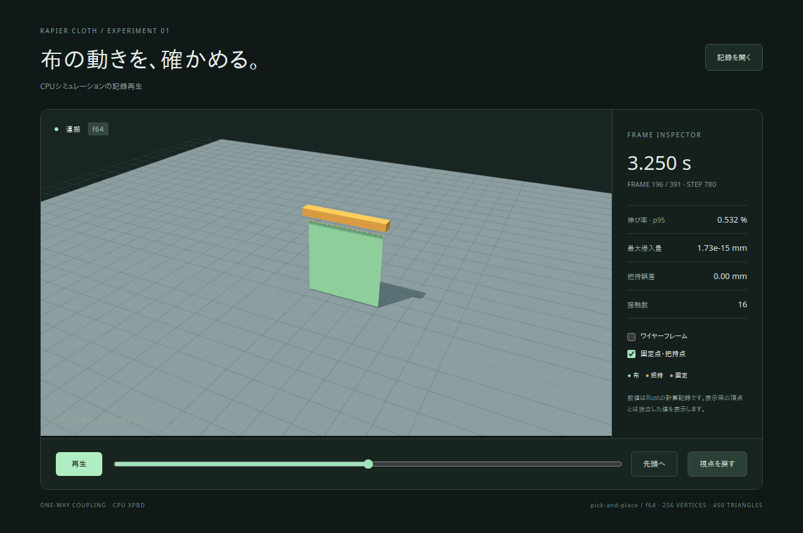

# Implementation evidence

Scope: PR0, PR1a, PR1b, PR2a, PR2b, PR3a, PR3b, PR3c and R0 from [the plan](implementation-plan.ja.md). Registry publication is outside R0. The labels are implementation units; the review branch groups them into coherent commits.

| Phase | State | Evidence |
|---|---|---|
| PR0 | Complete | Both precision graphs, independent direct-Rapier consumers, rejected feature combinations, core dependency boundary |
| PR1a | Complete | Grid topology, invalid meshes, surface density mass, generational handles |
| PR1b | Complete | Analytical integration/distance references, dihedral finite differences, 10,000-step drape in f32/f64 |
| PR2a | Complete | Four primitives, corner contacts, penetration stabilization, atomic contact budget failure |
| PR2b | Complete | Thin-box sweep, filters and BVH lifecycle, world/h/step contracts, checkpoint replay |
| PR3a | Complete | Local anchors, rotation/translation, release, deletion/reuse, selective exclusions, kinematic motion limits |
| PR3b | Complete | Coulomb slowdown and moving-surface velocity; canonical pick-and-place and exact JSON roundtrip in f32/f64 |
| PR3c | Complete | Actual f64 Rust recording matched browser GPU buffers/body poses; playback/seek/camera/upload tests passed; f32/f64 scaling data stored in evidence/ |
| R0 | Complete | Both workspace archives verified; independent consumers used extracted sources; all 11 platform/MSRV/viewer/package CI jobs completed successfully |

The resolved dependency graph requires Rust 1.90, despite Rapier's own 1.86 declaration: nalgebra 0.35, safe_arch 1.2 and wide 1.7 need 1.89; ordered-float 5.5 needs 1.90. Development uses 1.93.0. Linux local MSRV checks and both remote MSRV jobs passed. Completed job logs were inspected before declaring platform success.

The horizontal 32×32 hanging fixture completed 10,000 substeps at h=1/240 and 8 iterations. The maximum of the final 1,000 steps' p95 stretch was 0.016481519 (f32) and 0.01647869953082659 (f64), below 0.05. The free corner dropped below y=0.2, so this checks actual deformation.

The canonical manipulation fixture uses 16×16 vertices, 0.3m size, 1/240s substeps, 8 iterations, default material. Release is at 4s with 0.2m/s horizontal velocity; the final maximum height is approximately 0.005012m. Capture happens after settling, and transport distance is measured from the captured position. All recorded steps passed finite-value checks. The maximum single-edge stretch during the whole operation was about 18.22% for f32 and 5.67% for f64 in the local runs; the hanging fixture's 5% p95 gate is a different measure and is not a blanket deformation guarantee for this operation.

The replay viewer passed two Chromium tests against the actual f64 recording: first/middle/last frames and backward seeking, GPU f32 conversion, normals/bounds, body poses/local offsets, anchors/pins, numerical labels, playback/pause, wireframe, marker visibility, camera drag/reset, and valid/invalid file input. This is replay validation, not browser-side cloth physics.

## CI and distribution evidence

The source acceptance run [34726634469](https://github.com/neka-nat/rapier-cloth/actions/runs/34726634469) tested commit `53afdb2bf5f5ad6220c80bff79a1c135112dc312` and completed with **success** for all 11 jobs: Linux/Windows/macOS × f32/f64, MSRV 1.90 × f32/f64, feature/dependency boundaries, replay viewer, and package consumers. This was checked from both completed metadata and the actual job logs, not inferred from local Linux tests.

- [Completed CI metadata](evidence/ci-source.json) / [job result excerpts](evidence/ci-source-checks.log)
- [Local core f32](evidence/core-f32.log) / [core f64](evidence/core-f64.log)
- [Local bridge f32](evidence/bridge-f32.log) / [bridge f64](evidence/bridge-f64.log)
- [Pick-and-place f32 summary](evidence/pick-f32-summary.json) / [f64 summary](evidence/pick-f64-summary.json)
- [Scaling methodology and measured results](benchmarks.ja.md)

The core contains 13 integration tests per precision; the bridge contains 27 plus the README doctest, with one further test in each standalone consumer. The complete-revolution kinematic fixture was added during final review and is included in the source acceptance run. The first CI attempt failed because `rg` was absent on the runner; the diagnostic checker now uses a standard `grep` fallback and the corrected job passed.

The local package script completed at `/tmp/rapier-cloth-package-iPtVxK`; that earlier local archive snapshot was subsequently covered by the final source's remote package job. The remote job packaged and verified both crates with default-equivalent f32 and explicit f64 features, then built and ran a fresh consumer for each precision using only extracted archives. Both archive manifests lose workspace path dependencies, core's only normal dependency is glam, and serde/serde_json remain dev dependencies. The successful source package job is [103641788449](https://github.com/neka-nat/rapier-cloth/actions/runs/34726634469/job/103641788449).

The workflow retains `crate-archives-and-consumer-evidence` and `viewer-recording-and-browser-evidence` artifacts for subsequent runs. The latest evidence commit is revalidated by the [PR checks](https://github.com/neka-nat/rapier-cloth/pull/1/checks). R0 is local/CI distribution verification; crates.io publication and merging the PR have not been performed.

## Replay artifact

Generated from the canonical 16×16 fixture described in [examples](examples.ja.md), with Rust f64 computation and Chromium replay. The full 391-frame recording is [sample-f64.json](../demos/viewer/public/sample-f64.json). The browser check compares source doubles with the actual f32 GPU buffer at the first/middle/last frames and after backward seeks. A screenshot alone is not the acceptance oracle.

## CPU real-time performance update — 2026-09-13

[PR #2](https://github.com/neka-nat/rapier-cloth/pull/2) targets one 32×32 cloth at h=1/240s, four substeps/frame and eight iterations on CPU. The solver and bridge retain the original accuracy and failure gates. Closed-form bend gradients and sorted contact-state/sweep merges reduce the dominant costs. [Method, raw measurements and limitations](benchmarks.ja.md#realtime-cpu) document three runs per precision and fixture, using clean pre-optimization `a603f02` and optimized `5d9ac1e` sources.

The local f32 physics-frame p95 stayed below 16.67ms in all nine measured cases (three fixtures × three runs); individual outliers are retained. f64 moving-sphere p95 exceeded that budget in two runs. Rendering, GPU uploads and normal updates are not measured. This establishes the scoped CPU physics result, not application-wide or browser rendering throughput.

Both local precision suites passed, including the 10,000-substep hanging gate. Regression coverage now compares 2,000 bend cases with the original derivative chain, matches contact lambdas and projected positions against the original map algorithm, checks disappearing sweep candidates and cumulative budgets, and preserves fully excluded attachment pairs. The current core has 16 tests and the bridge has 30 including its README doctest per precision. Final platform, MSRV, viewer and extracted-package validation is reported in [PR checks](https://github.com/neka-nat/rapier-cloth/pull/2/checks); the earlier CI evidence above applies to the original MVP.

## Live CPU demo — 2026-09-13

The [live demo](live-demo.ja.md) now connects a Three.js UI to an actual local Rust solver. It supports 32×32 draping and hanging scenes, bounded sphere targets, wind forces, pause/single-frame/reset/release, camera controls and reconnection. Each connection owns a separate world and only advances when requested; no recording is loaded. Network dependencies are isolated in the unpublished `demos/live-server` crate.

Local Linux checks passed in f32 and f64: three native scene/state tests and three Chromium tests per precision, including wire-message/GPU-buffer parity, controls during pending reset, pin draw buffers, pause, independent connections, invalid input, disconnect and reconnect. Both existing replay tests also passed. The one-command launcher's actual browser connection advanced four substeps, and Ctrl+C closed both of its listening ports. The CI adds separate f32/f64 live jobs against production UI builds. These are functional software-WebGL checks, not a rendering-inclusive 60fps qualification on hardware GPUs.

The moving drape scene also passes 4,800 substeps (20 simulated seconds) in both precisions, with finite positions and penetration below 1mm at every substep. The sphere is half embedded in the floor and moves horizontally; this avoids trapping cloth in a closing gap between the floor and sphere. The UI reports the maximum diagnostic values across all four substeps in each frame. This scene-specific check does not qualify arbitrary obstacle gaps or self-collision.

The live material now uses bending compliance 1e3 after comparing 1e-4, 10, 100 and 1000 on the same 32×32 scenes. This permits folds around the sphere while retaining zero stretch compliance, the original mass/damping/friction, four substeps and eight iterations. Wind also includes a smooth travelling gust over rest coordinates to produce local billowing. Both precision scene suites (including the 20-second drape) and actual Rust/Chromium browser suites passed again. A separate real WebSocket f32 hanging run at maximum wind completed 4,800 substeps with finite positions, maximum penetration 8.15e-8m and maximum frame p95 stretch 4.17%. The live guide screenshot was refreshed from the running f32 server; these are functional checks, not a new 60fps qualification.
