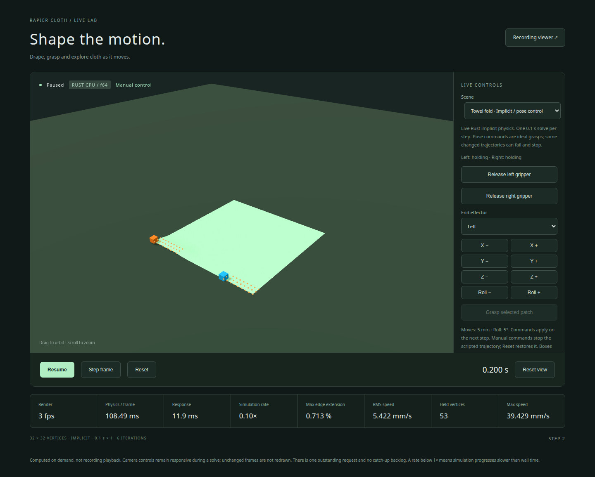

# Rapier end-effector control

The experimental implicit towel demo accepts world poses for two Rapier
kinematic bodies. Hard vertex attachments carry the cloth through body-local
anchors. The headless example and live server share the same host adapter:
[implicit_robot.rs](../examples/support/implicit_robot.rs). This is an example-level
integration contract, not a new stable robot-control API.

## Run and operate

```bash
npm --prefix demos/viewer ci
npm --prefix demos/viewer run live:implicit
```

Open **http://127.0.0.1:5173/live.html?scene=implicit_towel&paused=1**.
The launcher builds the Rust server with `f64,implicit`. This scene uses four
CPU workers, one 0.1 s physical solve per request, and one 32×32 towel.
The library's default execution remains serial.

Press **Resume** for the reference fold, release and settle sequence.
For manual operation, leave the task paused, select a hand, use **X/Y/Z ±**
(5 mm) or **Roll ±** (5 degrees about world X), then press **Step frame**.
A pose button queues the target without advancing simulation time.
**Release left/right gripper** and **Grasp selected patch** act without stepping.
Any manual command ends the scripted trajectory and holds the other hand at its
current pose. **Reset** restores the initial cloth, hands, grasps, clock and script.
Each task ends at 80 accepted steps (8 simulated seconds), including manual tasks.

The orange and blue boxes mark end-effector frames. They have no collision
geometry or force feedback. Both hands initially hold fixed material patches
(left 27 vertices, right 26). Regrasp selects that hand's original patch and stores
its current shape as local anchors; it does not teleport the cloth. The hand's
origin must be within 2 cm of the patch's first vertex. Arbitrary layer selection,
physical fingertips and a robot arm/controller are outside this example.



Captured from the live Rust server in Chromium software WebGL.

## Connect a host controller

Use metres, seconds, a Y-up world frame and unit quaternions in **[x, y, z, w]**
order. The shared Rust adapter accepts:

```rust,ignore
task.set_pose(0, translation, rotation, task.step + 1)?;
task.set_pose(1, other_translation, other_rotation, task.step + 1)?;
task.tick()?; // advances Rapier and cloth together by 0.1 s
task.release(0)?; // retains current cloth positions and velocities
```

In manual mode, a target remains in force until replaced. Commands are validated
before mutation. A pose must target exactly the next accepted step, remain in
x/z = ±0.75 m and y = 0..0.75 m, and move no more than 5 cm or rotate more than
22.5 degrees relative to the last accepted pose. Multiple pose updates do not
bypass these per-step bounds. These limits bound this demo's input; they do not
guarantee convergence for every allowed motion.

The matching browser protocol (version 2) uses the existing local WebSocket.
For example, at accepted step 0:

```json
{"request_id":1,"command":{"type":"set_gripper_pose","gripper":0,"translation":[-0.25,0.005636,0.25],"rotation":[0,0,0,1],"at_step":1}}
```

Read the current pose from `frame.implicit.grippers` before constructing a target.
Other commands are `step`, `release_gripper`, `grasp_gripper`, and
`reset` with `scene: "implicit_towel"`. Gripper IDs are 0 (left) and 1 (right).
A pose response acknowledges the pending target in `implicit.desired`; actual
body poses and cloth positions change only after a successful `step`.
For coordinated motion, acknowledge both hands' commands before sending `step`.

Frames also expose the accepted clock, current grasp anchors, `automatic`,
`completed`, `stopped` and measured extension/speeds. `implicit_available`
advertises server capability. The ordinary f32 server cannot create this scene.
The browser keeps one request in flight and coalesces unsent commands per hand;
it does not interpolate poses or accumulate catch-up physics. See the
[live protocol](live-demo.md#architecture) for transport and origin settings.

## Failure and recovery

Before each solve, the adapter checkpoints cloth, Rapier bodies/caches/joints,
and grasp ownership. Failure restores the last accepted physical state and clock,
preserves the pending manual targets, and latches the error. The live server sends
that accepted state with zero advanced substeps; the browser stops.
Use **Reset** before sending further motion. Neither extra physical substeps nor
larger Newton budgets are silently inserted.

An invalid command returns an error without changing the task. The browser pauses;
a valid replacement command or reset can be sent. Disconnect/reconnect creates a
new independent world.

## Headless reproduction and evidence

```bash
cargo run --locked --release --no-default-features --features f64,implicit --example robot_towel_implicit -- --output robot-fold.jsonl
cargo run --locked --release --no-default-features --features f64,implicit --example robot_towel_implicit -- --case grasp_inset --workers 4
```

The output path must be new. JSONL includes actual hand poses, grasp ownership,
accepted cloth states, timing and terminal status. This diagnostic format is
separate from the recording viewer's schema; use the live page to inspect robot
control. `--workers 1` selects serial execution; this example defaults to 4.

The nominal Rapier-body path completed all 80 steps locally. Position differences
from the earlier directly pinned reference were below 2.8e-8 m. All 80 live states
matched the headless robot example exactly on the same build and host.

A bounded h=0.1 screen of the directly prescribed fixture passed the nominal
case, grasp inset by one grid column, left release one step early, right release
one step late, and friction 0.4 and 0.6. A sinusoidal lift increase of only 5 mm
failed at step 24 (2.4 s) under the unchanged 80-iteration budget. These six
successful cases and one failed case do not qualify arbitrary manual motion.
Independent geometry checks found no intersections or clearance violations in
the 591 retained endpoint states, including the failed prefix and robot baseline;
endpoint sampling is not a continuous-motion proof.

Physical success at h=0.1 and wall-clock responsiveness are separate requirements.
See [live performance](performance.md#implicit-live-response).
